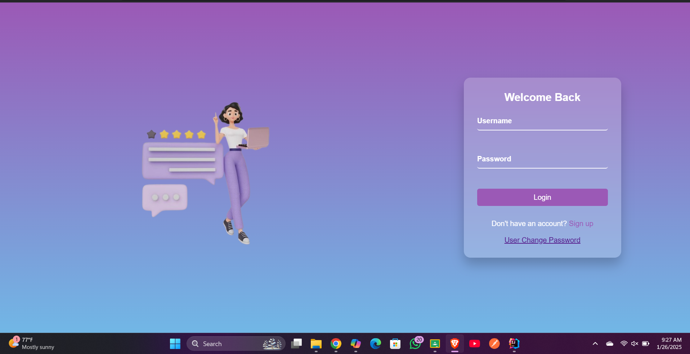
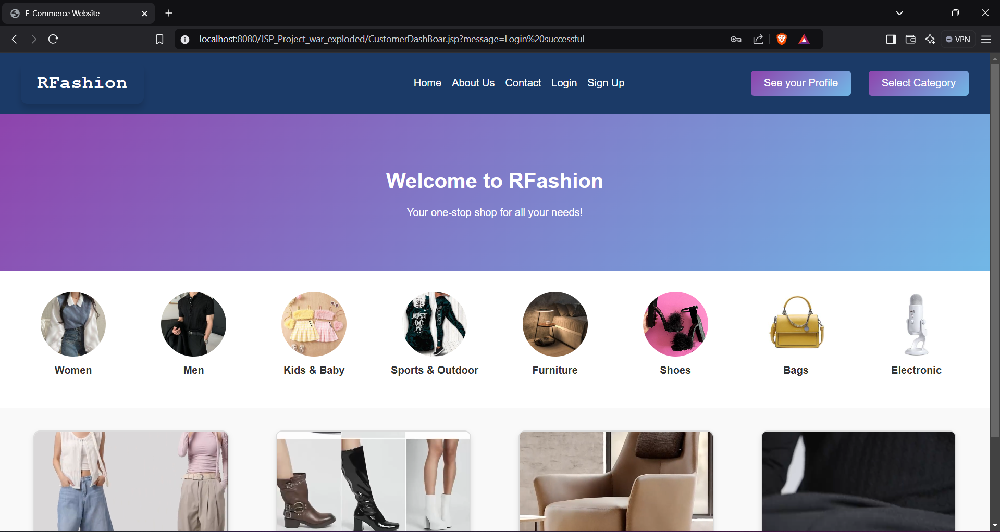
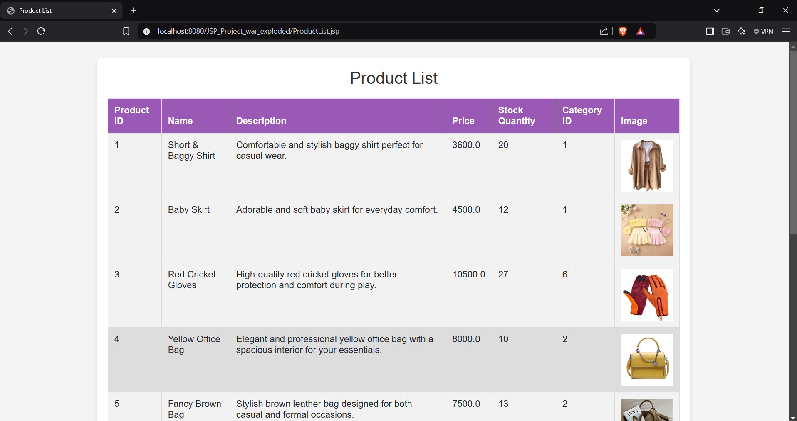
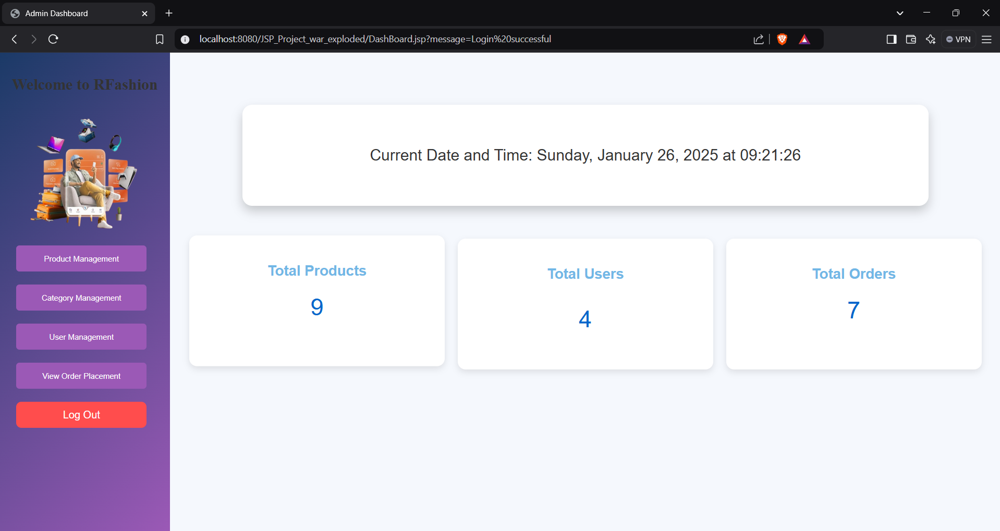
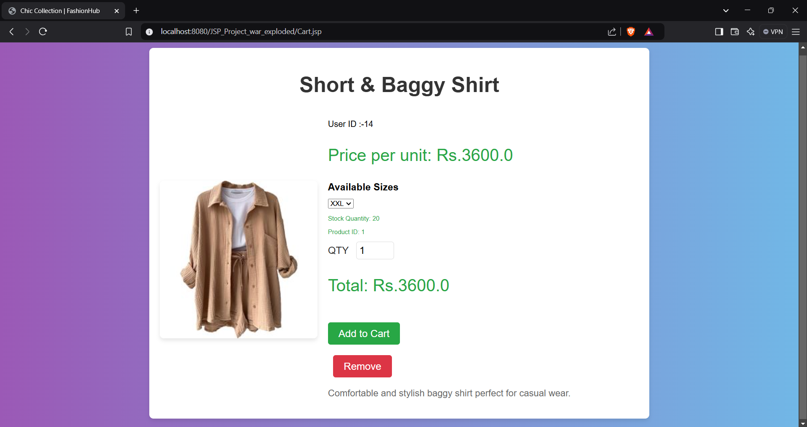
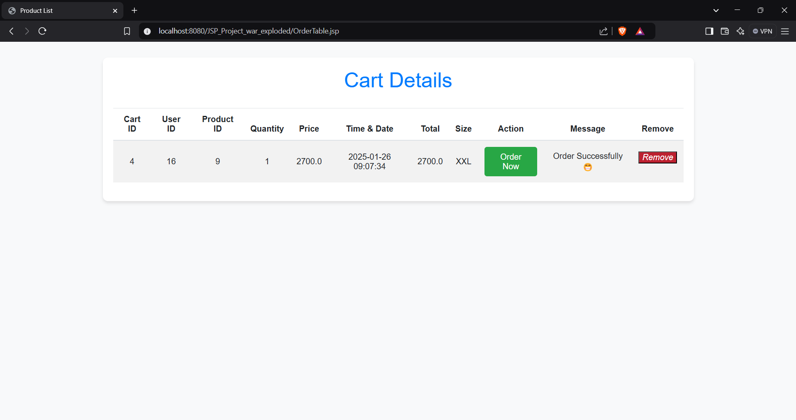

# E-Commerce Web Application

## Project Description
This project is a fully functional e-commerce web application developed using JavaEE, JSP, and JDBC connection pooling. It includes key features such as product management, user authentication, order processing, and cart management. The system is designed with a layered architecture to ensure scalability and maintainability.

---

## Features

### Administrator Features
- **Product Management**: Add, view, update, and delete products.
- **Category Management**: Add, view, update, and delete product categories.
- **Order Management**: View all orders placed by customers.
- **User Management**: View, activate, or deactivate customer accounts.

### Customer Features
- **User Authentication**: Registration, login, and logout.
- **Product Browsing**: View products by category, search by name, and sort by price.
- **Shopping Cart**: Add products to the cart, update quantities, and remove products.
- **Order Placement**: Place orders and view order history.
- **User Profile Management**: Update personal information and password.

---

## Technologies Used
- **JavaEE** for server-side application logic.
- **JDBC** with connection pooling for efficient database access.
- **JSP** for dynamic web content generation.
- **MySQL** for data storage.
- **HTML/CSS** for the frontend.

---

## Installation
1. Clone the repository.
2. Set up the MySQL database and import the `ecommerce.sql` schema.
3. Configure the database connection pool in `context.xml`.
4. Deploy the project on Apache Tomcat.

---

## Screenshots
- **Login Page**:

- **Home Page**:

- **Product List**:

- **Admin Dashboard**:

- **Cart Management**:

---

## Demonstration Video
Watch the full demonstration here: [YouTube Link](https://youtu.be/Ybc35mQjU1k?si=zhl9wnzRfii9IhZu)

---

## License
This project is licensed under the MIT License. See the LICENSE file for details.

---

## Future Improvements
- Implementing advanced search filters.
- Using AJAX for seamless cart updates.
- Adding user roles with more fine-grained permissions.

---

## Acknowledgments
Special thanks to the instructors and peers who provided valuable feedback during development.
